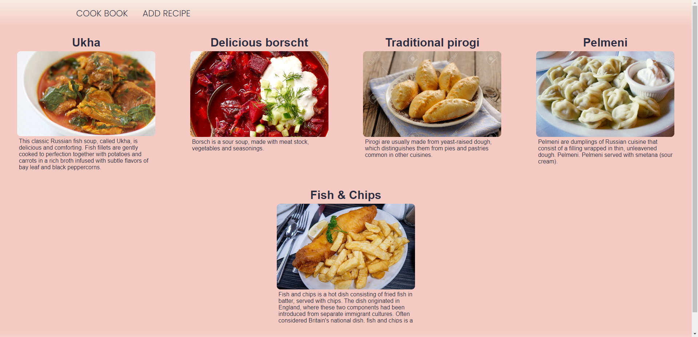
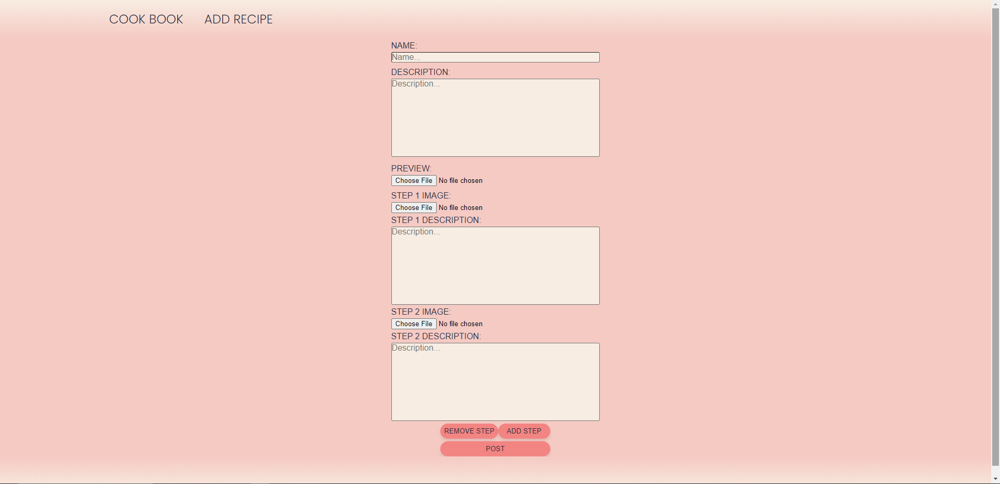
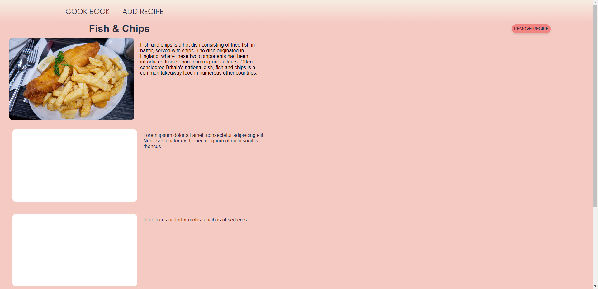

# CookBook

It's a simple application for publishing and browsing cooking recipies. Frontend made with react and backend with ASP\.NET. Main goal of this project was working with images, storing them and transfering them via http. 

## Working with images:

I came up with a way of dealing with images myself, so it's likely to be ineffective. Frontend turns images into base64 string and passes to backend, there image is converted back and stored as file, no compression, no anything.

## Screenshots:

